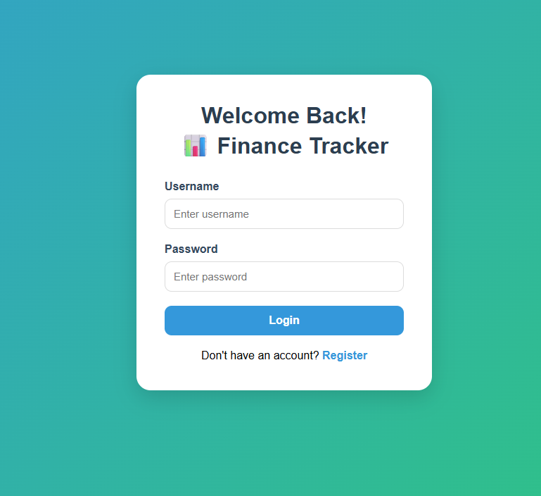
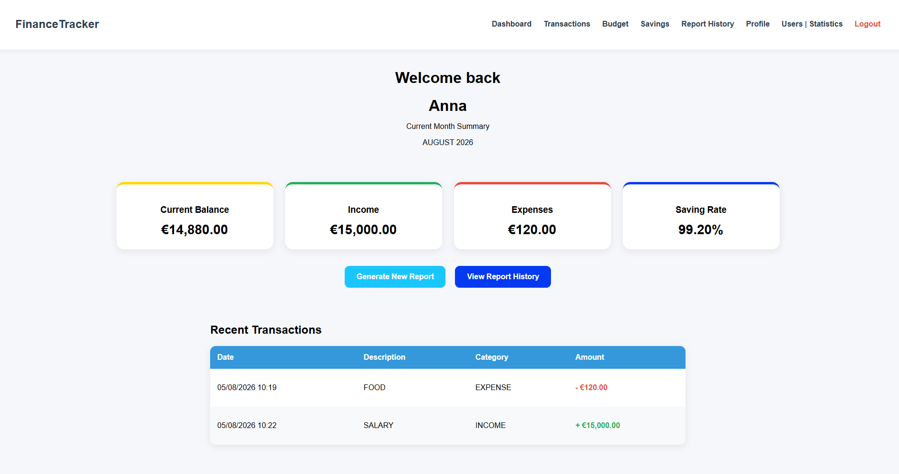
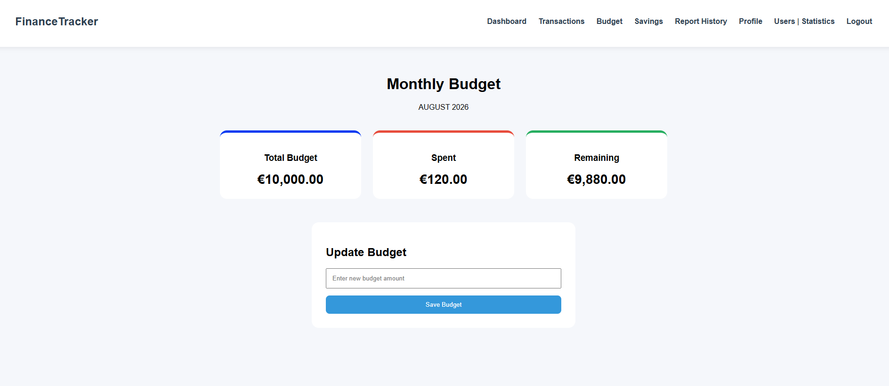
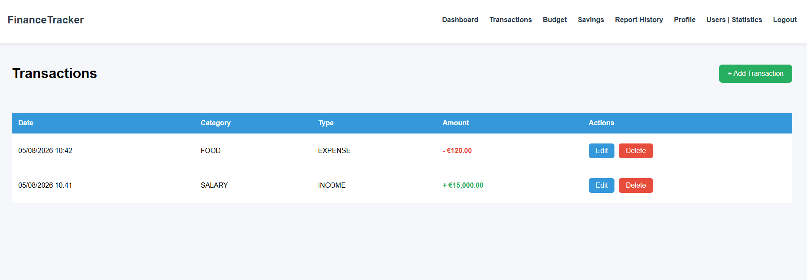
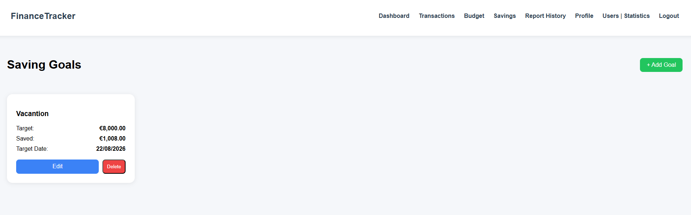
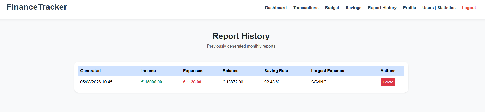

# Personal Finance Tracker

## Repositories

- **Main Application:** https://github.com/anna585/personal-finance-tracker-fund
- **REST Microservice:** https://github.com/anna585/budget-analytics-svc

## Overview

Personal Finance Tracker is a full-stack Spring Boot web application that helps users manage their personal finances by tracking income and expenses, creating monthly budgets, monitoring saving goals, and generating financial reports.
The application integrates with a separate REST Analytics microservice responsible for generating dashboard summaries, reports, and user statistics.
The project was developed as part of the Spring Advanced course.

---

## Features

### Authentication

* User registration
* User login

### Transactions

* Add new transactions
* Edit transactions
* Delete transactions
* View transaction history
* Categorize transactions as income or expense

### Budget Management

* Create monthly budgets
* Update budget limits
* Track remaining monthly budget

### Saving Goals

* Create saving goals
* Delete saving goals
* Edit saving goals

### Dashboard

* Current balance overview
* Monthly income summary
* Monthly expense summary
* Saving rate in percents
* Recent transactions overview

### Administration

* View registered users
* Manage users
* View application reports and statistics

---

## Technologies Used

### Backend

- Java 17
- Spring Boot
- Spring MVC
- Spring Security
- Spring Data JPA
- Hibernate
- Spring Scheduling
- Spring Cache
- Spring AOP
- OpenFeign
- Lombok

### Testing

- JUnit 5
- Mockito
- Spring Boot Test
- MockMvc
- H2 Database

### Frontend

* Thymeleaf
* HTML5
* CSS3

### Database

* MySQL

### Build Tool

* Maven

## REST Microservice

This project uses a separate REST microservice responsible for analytics and reporting.
The REST microservice communicates with the main application through Spring OpenFeign and is responsible for performing analytical calculations.

The microservice provides:
- Monthly dashboard summary generation
- User statistics calculation
- Report generation based on transactions
- REST API endpoints consumed via OpenFeign

### Technologies
- Java
- Spring Boot
- Spring Web
- Spring Data JPA
- Spring Cache
- Spring Scheduling

### Repository

You can find the REST microservice here:

👉 https://github.com/anna585/budget-analytics-svc

---

## Project Structure

```
Personal Finance Tracker
│
├── Main Application
│   ├── User Management
│   ├── Transactions
│   ├── Budgets
│   ├── Saving Goals
│   ├── Reports History
│   ├── Profile
│   └── Dashboard
│
└── Budget Analytics REST Microservice
    ├── Monthly Summary
    ├── Statistics
    └── Report Analytics
```

## Communication

The main application communicates with the analytics microservice using Spring OpenFeign.

Available endpoints:
- `POST /api/v1/analytics/summary`
- `POST /api/v1/analytics/statistic`
- `POST /api/v1/analytics/report`
- `GET /api/v1/analytics/report-history`
- `DELETE /api/v1/analytics/report-history/{reportId}`

### User

Stores user account information and roles (USER/ADMIN).

### Transaction

Stores income and expense records, transaction type and category.

### Budget

Stores monthly budget information.

### SavingGoal

Stores user saving goals.

---

## Application Architecture

The application follows a layered architecture:

* Controllers
* Services
* Repositories
* Entities
* DTOs
* Mappers
* Security
* Exception
* Scheduled
* Aspect

This structure separates business logic from presentation and data access layers.

---

## Main Business Logic

### Current Balance

```
Current Balance = Total Income − Total Expenses
```

### Remaining Budget

```
Remaining Budget = Monthly Budget − Monthly Expenses
```

### Saving Goals

Creates a saving financial goal by automatically adding 10% of the remaining monthly budget to the user-entered amount. If the remaining budget is insufficient, an error message is shown.

### Role Management

The application supports two user roles:

- USER – manages personal finances
- ADMIN – manages users and statistic


## Installation

1. Clone both repositories.
2. Configure MySQL.
3. Run the REST Analytics Microservice.
4. Run the Main Application.
5. Open:

```
http://localhost:8080
```

## Screenshots

- Login



- Dashboard



- Budget



- Transactions



- Saving Goals



- Report History



---

## Future Improvements

- Email notifications
- CSV/PDF report export
- Multi-currency support
- Charts and financial trends
- Docker deployment
- CI/CD pipeline

---

## Author

Developed by Anna as a Spring Advanced course project.
